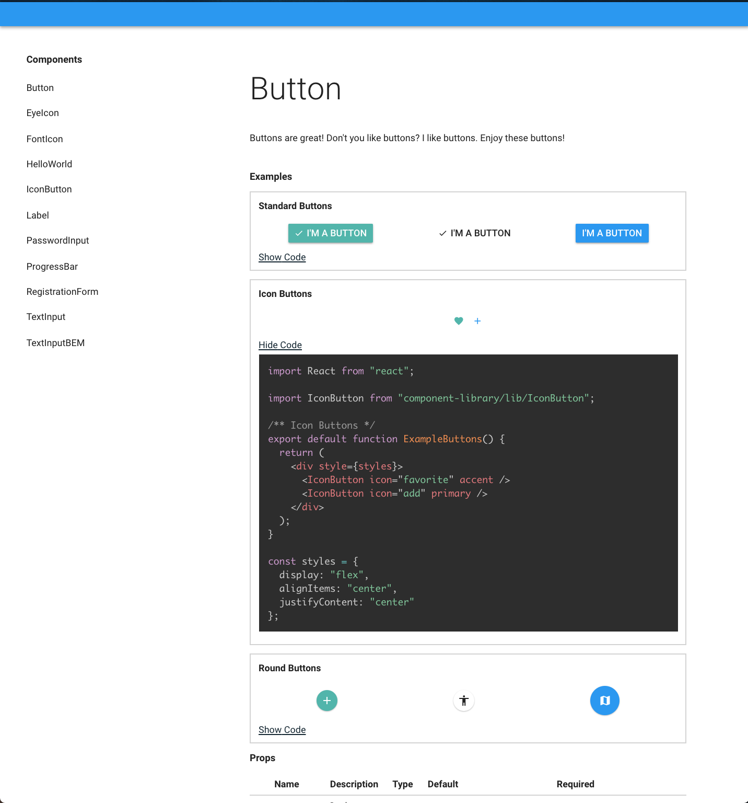

# React Components

I'm working on developing both a documentation system, and library of tested, reusable, and customizable React components that I can use for my future projects!

Design inspired by React-Toolkit and MaterialUI

> View live at: http://mikaelia.github.io/react-component-library/

Enjoy!

## Docs

[Component documentation](http://mikaelia.github.io/component-library)

## Roadmap
[x] Button
[x] IconButton
[ ] Input

## ScreenShots



## Install

```
npm install component-library
```

